# Welcome

This hands on workshop demonstrates the **[SAS Extension for Microsoft Visual Studio Code](https://github.com/sassoftware/vscode-sas-extension/)** and its integration with the SAS Viya platform for efficient data science programming. We explain how to configure VS Code to work with the SAS Programming Runtime Environment, access and execute SAS program code, work with data, integrate source code management with Git, and more.

By enabling SAS programming development in VS Code, you will have a fully integrated development environment that supports your SAS analytic workflows.

**SAS INNOVATE 2026 HANDS-ON WORKSHOP**

# Working with the SAS Extension for Visual Studio Code

- [Open Visual Studio Code](#open-visual-studio-code)
- [The layout of Visual Studio Code](#the-layout-of-visual-studio-code)
- [Customizing VS Code](#customizing-vs-code)
- [Getting started with Git in VS Code](#getting-started-with-git-in-vs-code)
- [Connect to SAS Viya with the SAS Extension](#connect-to-sas-viya-with-the-sas-extension)
- [Upload workshop data](#upload-workshop-data)
- [Working with data](#working-with-data)
- [Working with Source Control in VS Code](#working-with-source-control-in-vs-code)
- [Working with SAS Notebooks](#working-with-sas-notebooks)
- [Set up your own connection profile](#set-up-your-own-connection-profile)
- [All done](#all-done)
- [Next steps](#next-steps)

## Open Visual Studio Code

In this hands-on environment, you should be logged into a virtual machine and see the Windows desktop. Find the Visual Studio Code icon on the left side of your screen:


Double-click to open it. Then resize and place the window as desired.

## The layout of Visual Studio Code

**Microsoft Visual Studio Code** (**VS Code**) is a free, open-source code editor that supports various programming languages and offers features like debugging, syntax highlighting, and version control.

If you are not familiar with VS Code, take the time to explore the user interface.


The **Working Area** is in the the center. This is where you work to edit edit code, view logs, and display results. Not much to see there right now. :)

The **Activity Bar** on the left provides access to major VS Code feature areas. Currently it contains several items we will use. These include:

*   The **Explorer** item where folders and files are shown

*   **Source Control** to handle the tasks associated with Git activity, including commits, branching, staging, pushing, pulling, stashing, etc.

*   **Extensions** where you can access and configure additional functionality for VS Code.

*   **SAS** is what we're here for. It's a great example of an extension that extends VS Code's capabilities - in this case, to integrate with your backend SAS environment

And finally, the **Command Palette** at the top is frequently used. Besides providing keyboard-based access to features, it's often the UI element that appears when called and to answer prompts when performing certain tasks.

## Customizing VS Code

Let's customize VS Code and choose a darker color scheme.

Open the VS Code Menu and select **File** > **Preferences** > **Theme** > **Color Theme**:

The **Command Palette** field prompts you to "Select Color Theme". Type "sas" and choose the **SAS Dark** theme:


The color scheme is just one of the many preferences you can modify... so now you know where to find them.

## Getting started with Git in VS Code

Working with Git repositories in VS Code is extremely easy.

VS Code has integrated source control management (SCM) and includes Git support out-of-the-box.

Let's clone a GitHub repository.

The easiest way to do this is to select the **Source Control** icon in the **Activity Bar** and click the button to **Clone Repository**:


But to showcase the power of the Command Palette, let's take a different approach. In the VS Code menubar, select **View** > **Command Palette...** (alternatively, if you prefer a keyboard shortcut, just type **Ctrl+Shift+P**):


In the Command Palette field, start typing "**Git: Clone**" and select it from the list.


Next, the Command Palette will prompt for a repository location. Paste the following URL for this workshop's GitHub repository and press Enter to **Clone from URL**:

`https://github.com/SASInnovate2026/Working-with-the-SAS-Extension-for-Visual-Studio-Code.git`

> &#x26A0; *Attention: Do not select **Clone from GitHub** as that uses a different technique requiring a user's authentication credentials.*
>
> 

You are then prompted to **Choose a folder to clone into** with a file explorer window.

Any place you prefer is suitable, but for this workshop we'll keep the current "student" home directory. Just click the **Select as Repository Location** button.


When prompted about opening the cloned repository, click **Open**. And when asked if you Trust the Authors, click **Yes**.


You should now see your cloned repository folder in the **Explorer** view:


### &#x1F6A9; Status Check

We've cloned a project to work with in VS Code. By cloning the project, we have placed a copy of the repo on our own PC here. Because it's our own copy, then we can view files, make changes, or do anything else we want with it.

## Connect to SAS Viya with the SAS Extension

Now let's see what it looks like to work with SAS Viya in the VS Code app. Click the **SAS logo** icon in the **Activity Bar**:


If this is the first time opening the SAS Extension in this session of VS Code, you'll likely see a button to sign in to the SAS Viya backend:


Click the **Sign In** button. If prompted, click "Allow" for the "extension 'SAS' to sign in using SAS". Next, a new browser window will open with the "student" user's credentials prefilled for you:

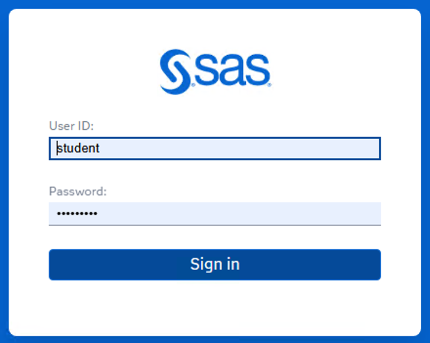

Click *that* **Sign In** button. Then you're presented with two choices:

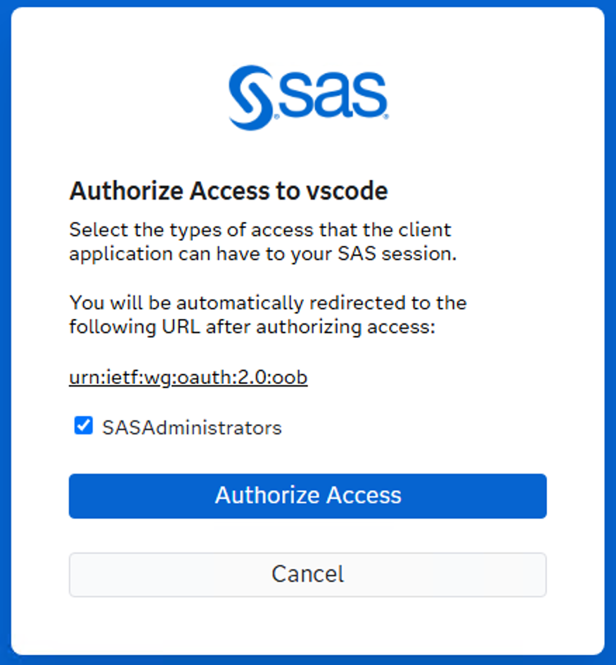

-   Select the "**SASAdministrators**" checkbox for your user to assume administrative privileges. We don't really need it here, but it's good to know about it.
-   Click the **Authorize Access** to proceed with the sign on process.

Next you're given a unique one-time code to enter into VS Code to complete signing in:

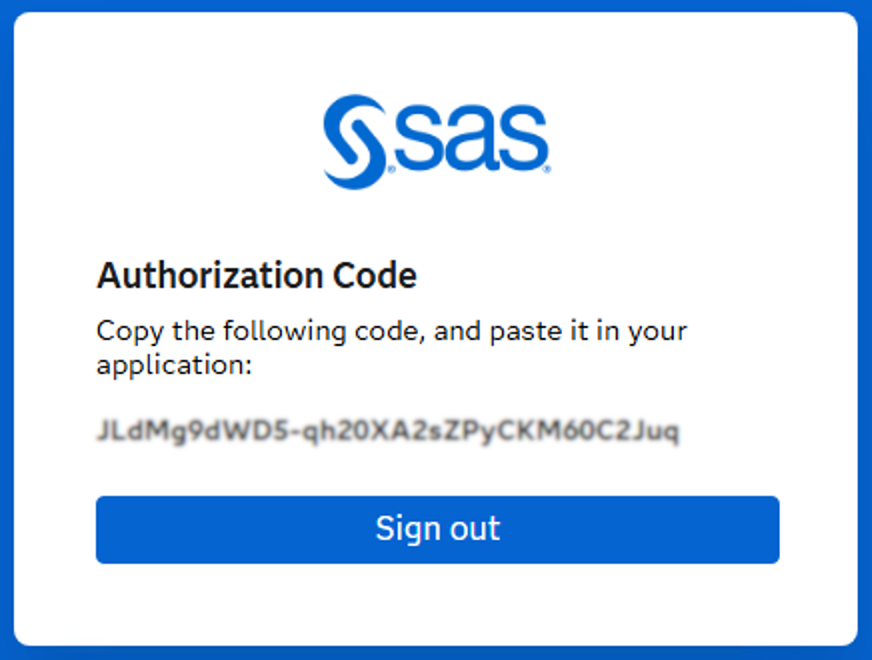

As instructed, copy the code provided and switch back to the VS Code app. At the top of the VS Code window, enter the authorization code in the field provided:

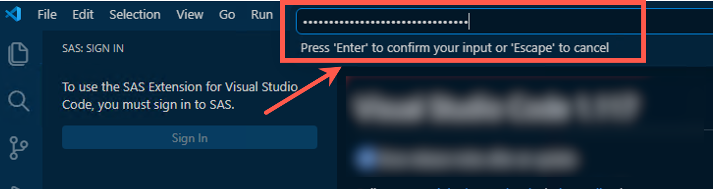

Once connected to the SAS Viya backend, you should see three main views into the SAS environment there:

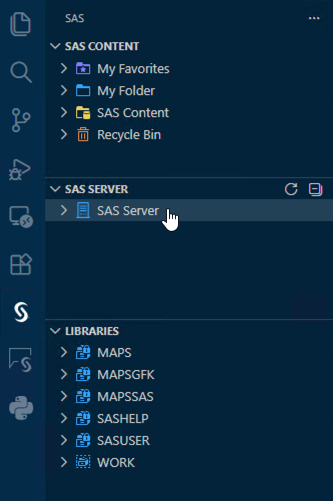

- **SAS CONTENT**: This includes report outputs, models, pipelines, and all the kinds of things you create while working in SAS Viya.

- **SAS SERVER**: This is a view into the files hosted in the operating system as visible from the SAS Compute Server running in SAS Viya. It's subject to all kinds of Kubernetes considerations, file permissions, etc.

- **LIBRARIES**: These are the familiar SAS library resources where you can see data that's available to SAS.

Feel free to click around to see what's there.

As a best practice, you can switch back to the web browser where the authorization code was provided and click the **Sign Out** button. That won't affect your connection in VS Code.

### &#x1F6A9; Status Check

You've connected to SAS Viya using the SAS Extension for VS Code and you can navigate the data resources available.

## Upload workshop data

Normally you'd expect to find your data mart of tables, files, and data sets attached to the server with a SAS library. But for this exercise, we wanted to show the ability move relatively small files from your PC up to the SAS Viya server to work with them, too.

Expand the **SAS SERVER** heading to show the **SAS Server** sub-heading > **Home** > **home** > **student**:

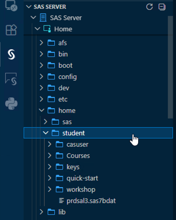

We're going to upload some data here. If you right-click on the **student** folder, you'll see "Upload files". But don't use that. It only works for text files, and we want more.

Let's use the Terminal capability. That's a command-line interface and with it, we can use the "scp" utility to securely copy files up to the server.

In the **View** menu at the top of the VS Code window, click on **Terminal**. A new pane opens for you across the bottom of the VS Code window. The Powershell command prompt should show that you're currently in the "Working-with-the-SAS-Extension-for-Visual-Studio-Code" directory. Type `ls` and confirm you see the following:

```log
PS C:\Users\student\Working-with-the-SAS-Extension-for-Visual-Studio-Code> ls

    Directory: C:\Users\student\Working-with-the-SAS-Extension-for-Visual-Studio-Code

Mode                 LastWriteTime         Length Name
----                 -------------         ------ ----
d-----         3/26/2026   7:36 AM                Data
d-----         3/26/2026   7:36 AM                img
d-----         3/26/2026   7:36 AM                Programs
-a----         3/26/2026   7:36 AM           2039 README.md
-a----         3/26/2026   7:36 AM          33495 Working_with_the_SAS_Extension_for_VS_Code.md
```

See that `Data` directory? We want to upload that to the SAS Server. If the above looks right to you, then proceed with:

```bash
# Uploads the "Data" directory from this PC to the 
# student's home directory on the SAS Server
scp -r Data server.demo.sas.com:/home/student
```

Since this is likely the first time such a connection is made, you'll be prompted about confirming the host's authenticity. Answer `yes` at the prompt to continue connecting.

Next you'll be prompted for the `student` user's password. Enter `Metadata0`. The letters you type won't be visible - that's okay.

If you get connected, then scp will show you details about what's copied:

```log
>> scp -r Data server.demo.sas.com:/home/student

customers.sas7bdat          100%  320KB  52.1MB/s   00:00    
customer_churn.parquet      100%  175KB  42.6MB/s   00:00     
reviews.json                100%   12KB  11.9MB/s   00:00     
subscriptions.csv           100%   69    67.4KB/s   00:00    
techsupportevals.sas7bdat   100%  192KB  37.5MB/s   00:00    
```

### &#x1F6A9; Status Check

We have some local data files that we want to take a closer look at, so we uploaded them to the SAS server.

## Working with data

​As a data scientist at an online personal styling service, you’ll use machine learning models to help analyze customer churn. Customer “churn” simply means that our client has canceled their premium clothing subscription. And since it often is more difficult to find a new customer than keep an existing one, you will help identify which clients are about to churn, so that we can find ways to retain them.

Look closer at the **Data** folder we just created (see the **SAS SERVER** section). It contains data for our project in various file formats:

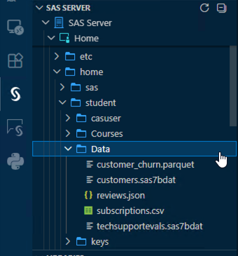

> *If you don't see the "Data" folder under the "student" home directory, then mouse-over the **SAS SERVER** section header above and click the refresh &#x21BB; icon to update the list.*

- **Customer churn** is a parquet table that provides metrics about customer activity over the last few months,
- **Customers** is a SAS data set that describes customers’ attributes, such as their estimated income, homeowner status and birth date,
- **Reviews** is a JSON file that lists customer reviews on recent purchases,
- **Subscriptions** is a comma-separated values text file that provides meaningful details about the customer’s subscriptions,
- And **technical support evaluations** is another SAS data set that gives the customers’ feedback on recent interactions with Technical Support.

In this hands-on, we will focus on the data preparation part of the project.

Even with our data spread across two SAS data sets, one CSV file, one JSON file, and one Parquet table, SAS makes it easy to bring them together.

### Reading a SAS data set

To read SAS data sets, we just need a SAS library. To create a SAS library, let's run some simple SAS code.

Start off by creating a new SAS program file: **File** > **New File...**. 

The Command Palette appears prompting you for the file's type and name. Select **SAS File**:


In the new *Untitled* SAS program file, copy the following code:

```sas
/* Churn demo - SAS data */
libname churn "" ;
```

In the Explorer, select the **Data** folder, right-click and select **Copy Path**:

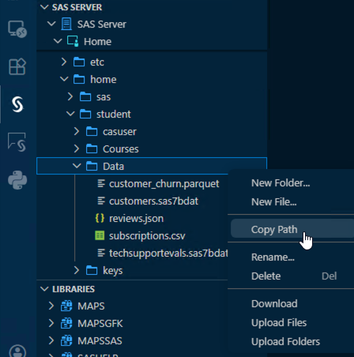

Paste the copied path between the double-quotes in your code.

This should look like the following:

```sas
/* Churn demo - SAS data */
libname churn "/home/student/Data" ;
```

You're ready to submit this code using the **Run** button:

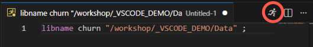

Again, the SAS log from running the submitted code will appear in the Output pane at the bottom of the work area. Confirm it worked as expected by finding the message, "**NOTE: Libref CHURN was successfully assigned**".

Now, look at the bottom of the SAS pane for the **LIBRARIES** section.There you should now see the **CHURN** library has been added and you can click to open a preview of the **CUSTOMERS** table.


### Reading a Parquet dataset

A SAS library reference consists of two primary elements: 1) the path to location on disk, and 2) the library engine.

We will access the Parquet dataset using a SAS library and specifying the "parquet" library engine. The Parquet file is at the exact same location as the SAS data sets. But we need a new library reference so that we can specify a different library engine that is able to work data in Parquet format.

> *Note: Parquet is a **columnar storage file format** optimized for efficient data storage and retrieval. It is commonly used in big data processing frameworks like Apache Spark and Hadoop due to its ability to handle large datasets with high performance and reduced storage requirements.*

Back in your SAS program file, add a new libname statement to access the Parquet dataset similar to:

```sas
/* Churn demo - Parquet data */
libname churn_pq parquet "/home/student/Data" ;
```

Submit the code to run on the SAS Compute Server.

> &#x1FA84; *Pro-tip: if you select/highlight the desired code in the SAS program, then when you hit the Submit (running man) button, only that selected code will run.*

Confirm the SAS log shows success:

```log
NOTE: Libref CHURN_PQ was successfully assigned as follows:
      Engine:        PARQUET
      Physical Name: /home/student/Data
```

And as before, look for **CHURN_PQ** in the **LIBRARIES** section of the SAS pane. Click on the **customer_churn** dataset to see a preview in the work area.

### Reading a CSV file

SAS doesn't offer a library engine to read simple CSV files. Instead, we can import the content of the file into a SAS data set.

In your SAS program file, add the following code:

```sas
/* Churn data - import CSV */
proc import file="/home/student/Data/subscriptions.csv" out=subscriptions dbms=csv replace ;
run ;
```

Submit this code to run. Notice that we did not provide a destination libref, so the resulting SAS data set will automatically write out to the **WORK** library.

Near the bottom of the SAS log, look for success similar to:

```log
NOTE: WORK.SUBSCRIPTIONS data set was successfully created.
NOTE: The data set WORK.SUBSCRIPTIONS has 3 observations and 2 variables.
NOTE: PROCEDURE IMPORT used (Total process time):
      real time           0.05 seconds
      cpu time            0.05 seconds
```

And as before, look for **WORK** in the **LIBRARIES** section of the SAS pane. Click on the **SUBSCRIPTIONS** data set to see a preview in VS Code's work area.


### Reading a JSON file

A JSON (JavaScript Object Notation) file is a lightweight, text-based format used to store and transport data. Data is organized into a hierarchy of key-value pairs and arrays that is designed to be easy for humans to read and simple for machines to parse.

We will access the reviews.json file using a SAS library and specifying the "json" library engine.

In your SAS program file, add the following code:

```sas
/* Churn demo - JSON Data */
libname rev json "/home/student/Data/reviews.json" ;
proc datasets lib=rev ;
quit ;
```

> *Note that a JSON-type of SAS library specifies the path to the JSON file, not to the folder.*

Submit the code to run in the SAS Compute Server.

The DATASETS procedure generates ODS output with a report that lists the logical tables stored in the JSON file. This is presented in a new "Result" tab to the right of your SAS program code:

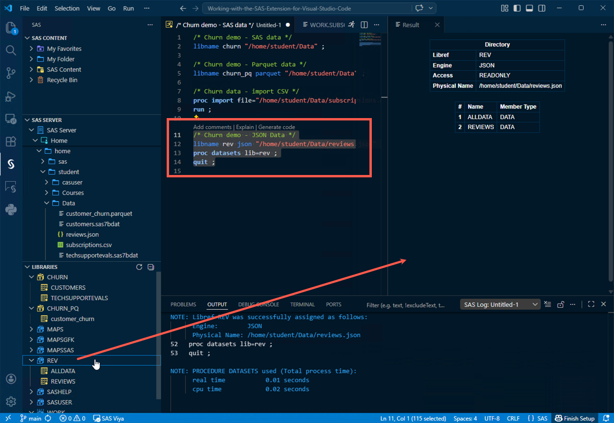

Also be sure to confirm success in the SAS log, look for:

```log
NOTE: JSON data is only read once.  To read the JSON again, reassign the JSON LIBNAME.
NOTE: Libref REV was successfully assigned as follows:
      Engine:        JSON
      Physical Name: /home/student/Data/reviews.json


19   proc datasets lib=rev ;
20   quit ;

NOTE: PROCEDURE DATASETS used (Total process time):
      real time           0.02 seconds
      cpu time            0.02 seconds
```

Finally, look in the **LIBRARIES** section of the SAS pane to find and open the resulting **REVIEWS** table in the new **REV** library.

> &#x1F4A1; *If you're an experienced SAS programmer acquainted with either SAS Display Manager or SAS Studio, then you should be in familiar territory here, recognizing the **SAS Program Editor**, **SAS Log**, and **SAS Output** windows now on display.*

### &#x1F6A9; Status Check

You have demonstrated several techniques to ingest data in different formats into the SAS Compute Server for analytics processing.

### Save your SAS program code

The **Explorer** icon in the Activity Bar should have a blue badge with the number 1 to indicate that the SAS program file you've been working with needs to be saved.


Select your SAS program file's tab in VS Code's work area. Then click **File** > **Save As...** and you should see a file explorer window appear to specify where to save your program.

You can select anywhere on the PC, of course, but we have a location in mind. Name your program `data_access.sas` and save it to:

`C:\Users\student\Working-with-the-SAS-Extension-for-Visual-Studio-Code\Programs`.

After saving your SAS program file, the blue notification badge on the **Explorer** icon will disappear. But now a new one has appeared on the **Source Control** icon in the Activity Bar:


Let's deal with that briefly next.

## Working with Source Control in VS Code

Source control (a.k.a., source code management, a.k.a., version control) is the practice of tracking and controlling changes to files over time. There are lots of variations and tools. [Git](https://git-scm.com) in particular is very popular and commonly used.

When you saved your SAS program file to the Programs folder in the repo location we cloned from Github, the local Git service noticed the change - and placed that new blue badge on the **Source Control** icon in VS Code's Activity Bar. That's a prompt for you to take the next steps: stage, then commit the change.

Your file is safely saved to disk, but it's not yet being formally tracked by Git for version control. Open up the **Source Control** section:

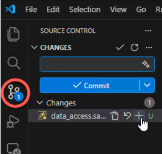

It currently shows your new `data_access.sas` program file under the list of **Changes** it noticed. We can *stage* that change in preparation for *commit* by clicking that **`+`** icon to the right of the file's name.

A new section named **Staged Changes** with your file will appear there above the Changes section.

> *Staging simply allows us to group one or more files together in preparation for commit.*

Enter a descriptive commit message in the field provided - like, "my nifty SAS program" - and click the **Commit** button.

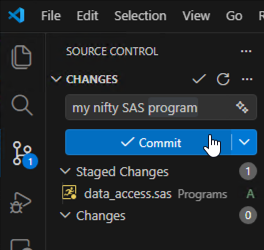

That updates the local Git repo so it can track this change - adding your new SAS program file to the project.

Or, it would - if we had initialized Git properly. &#x1F61C;

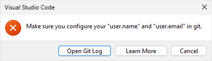

Click **Cancel**.

We'll stop here as we're just making the point about VS Code's support for Git as a source code management utility.

### Bonus

Assuming the commit above had worked, that just updates the *local* git repo on your PC. If you wanted to push that change up to the *remote* repo hosted in GitHub.com (or wherever), then VS Code can do that, too.

But...

That requires establishing authentication credentials with the [remote repo](https://docs.github.com/en/get-started/git-basics/about-remote-repositories) (in GitHub). And since you're not one of the maintaining authors of this particular project, you don't have the means to authenticate and push updates there. Makes sense, right? If it was your repo, you wouldn't want unknown, random folks on the Internet modifying your hard work.

You can, however, create your own GitHub (or wherever) repo that you own and configure your local Git to use that as its "[origin](https://docs.github.com/en/get-started/git-basics/managing-remote-repositories)". Then, you could push the changes up to a location under your control where you are authenticated.

### &#x1F6A9; Status Check

As your SAS program code evolves over time, it can be really helpful to track what changes were made, who made them and when, along with commit messages to help find key updates.

### Close open work

We're finished with the data access and git repo activities. Close your SAS program code file, data previews, SAS log output, and any other content in the Work Area.

---
---

## Working with SAS Notebooks

Python (and other languages) programmers have long enjoyed working with Jupyter Notebooks. They can be authored with two main types of content:

-   **Code (or Execute) cells**: Where you write and execute live code. The output appears directly below the cell.

-   **Markdown Cells**: Where you write formatted text, insert images, or otherwise provide descriptive information about the code and process.

The SAS Extension for VS Code offers similar functionality known as **SAS Notebooks**.

In a SAS Notebook, we can mix:

- Markdown, a lightweight markup language that uses plain text formatting syntaxfor easy conversion to HTML or other formats,
- SAS code,
- SQL code,
- and Python code.

### Start a new SAS Notebook

Create a new file by selecting the VS Code Menu > **File** > **New File...** and in the Command Palette prompt, select **SAS Notebook**:


By default, the new notebook has one empty cell that is for SAS code. Let's change that:


On the far right bottom of that empty cell is its type - currently, that's "SAS". Click on the word **SAS** there and in the Command Palette prompt, select **Markdown** as the language mode for that cell.

Let's create some text headers for this new notebook - in the Markdown field, enter:

```markdown
# Discover data

## Customers
```

To see what's described by the Markdown so far, try clicking on the checkmark &check; icon at the top right of the field:


You're shown a preview of the rendered output. Those hashtags # are how section headers are identified in markdown syntax.


### Interactive SAS programming in your SAS Notebook

Add a code cell by clicking on **+ Code** at the top of the notebook:


Confirm that it is a **SAS** cell:


Paste the following code in the cell to list the columns of the SAS data set:

```sas
/* List columns */
proc contents data=churn.customers varnum ;
run ;
```

Run the cell:


You should get your SAS output right below your code:


Add a new Markdown cell at the bottom of your output:


Add the following header text:

```markdown
## Churn
```

Validate the **Markdown** cell and add a new code cell:


Paste the following code to list the columns of the Parquet data set:

```sas
/* List columns */
proc contents data=churn_pq.customer_churn varnum ;
run ;
```

Run the cell.


Add a new Markdown cell:

- Level: **2** (i.e., with two hashtags ##)
- Title: **Build some distribution reports**

Validate/submit the markdown cell using the checkmark ✓ icon.

Add a **SAS** code cell, paste and run the frequency report and plot code:

```sas
/* Frequency report */
proc freq data=churn_pq.customer_churn ;
   tables lostcustomer / plots=freqplot() ;
run ;
```

Check the results and the plot:


You can observe that a SAS notebook shows SAS output when the SAS code generates it. You'll learn that it displays the SAS log otherwise.

What if you want to check the log when the code generates output?

Click on the ```...``` > **Change Presentation** between the code and the output:


Then select **SAS Log Renderer**:


You should see the SAS log now.

Add a new Markdown cell:

- Level: **1** (i.e., with one hashtag #)
- Title: **Join data**

Add a **SQL** code cell (the label is mistakenly marked as '**MS SQL**' when it should actually be '**SAS SQL**').


Use the following code to join all five tables:

```sql
create table churn_wip (drop=custId customerSubscrCode reviewId ordinal_root ordinal_reviews) as
   select *
   from churn_pq.customer_churn as churn
      left join churn.customers as cust on churn.custId=cust.custId
      left join subscriptions as subs on cust.customerSubscrCode=subs.customerSubscrCode
      left join churn.techSupportEvals as evals on churn.ID=evals.ID
      left join rev.reviews as rev on churn.reviewId=rev.reviewId
```

> *Notice that this SQL cell allows you to directly enter a SAS SQL statement without having to specify `PROC SQL` and `quit;`.*
>
> Can you spot the SAS SQL syntax items above?
>
> | Code syntax element | SAS SQL | ANSI or MS SQL |
> | -- | -- | -- |
> | `drop=` | SAS uses dataset options in parentheses to exclude columns | Invalid. You must explicitly list the columns you want in the SELECT clause |
> | `create table ... as` | Create a table from a query in SAS | Invalid in MS SQL. MS SQL uses `SELECT * INTO new_table FROM ...` |
> | Two-level names | Ex) `churn_pq.customer_churn` refers to a libref.dataset | Refers to schema.table |

Run the code and review the log output that's returned.

Select the **SAS** icon in the Activity Bar, look in the **LIBRARIES** section to find the **WORK** library. Check the contents of the **CHURN_WIP** data set.

> *If you don't see CHURN_WIP in the WORK library, mouse-over the **LIBRARIES** section and click the refresh &#x21BB; icon to update the list.*


Finally, let's save the final table as a Parquet data set.


Add a new Markdown cell:

- Level: **1** (i.e., with one hashtag #)
- Title: **Save final table in Parquet format**

Add a SAS code cell. Paste the following code that adds a computed variable "customerAge" and saves the dataset to a Parquet file named **churn_abt.parquet**:

```sas
/* Save data as Parquet dataset */
data churn_pq.churn_abt ;
   set churn_wip ;
   customerAge=intck('YEAR',birthDate,today(),'C') ;
run ;
```

Run the code, review the log output that's returned, and look for **churn_abt** in the **CHURN_PQ** library:


> *Note: If you don't see **churn_abt** data set in the list, try clicking the refresh &#x21BB; icon to update the list.*

View the table and confirm the new computed column "customerAge" exists (scroll all the way to the right).

### Interactive Python programming in your SAS Notebook

You're not limited to only run SAS code. Python is the *lingua fraca* for many programmers, data scientists, and modelers. Let's do that, too.

In this case, we'll combine Python programming code with [SAS PROC PYTHON callback methods](https://documentation.sas.com/doc/en/proc/latest/n1x71i41z1ewqsn19j6k9jxoi5fa.htm) to bring the two together.


Add a new Markdown cell:

- Level: **1** (i.e., with one hashtag #)
- Title: **Data discovery with Python**

And then add a new **Python** code cell with:

```python
# Move SAS data set to Python dataframe
df = SAS.sd2df("work.churn_wip")

print(" ")
print("\n👀 First look:")
print(df.head())

print(" ")
print("\n📊 Shape of the data:")
print(df.shape)

print(" ")
print("\n🧠 Quick summary:")
desc_df = df.describe(include='all')
print(desc_df)

print(" ")
print("\n🚨 Missing values:")
print(df.isna().sum().sort_values(ascending=False))

print(" ")
print("\n🎲 Random sample:")
print(df.sample(5))

print(" ")
print("\nFrequency for all categorical columns:")
for col in df.select_dtypes(include='object'):
    print(" ")
    print(f"\n🔹 {col}")
    print(df[col].value_counts().head())
```

SAS runs your Python code in its runtime (using [PROC PYTHON](https://documentation.sas.com/doc/en/proc/latest/p0sj9pq2ryjlphn1ceq7ntpc1ipp.htm)) and returns the results in the SAS log. Scroll through that content to confirm you see the expected output.

Then create another new Python code cell with content:

```python
# 1. Subset the data
df_gold = df[df['customerSubscrStat'] == "Gold"].copy()

# 2. Convert all missing values to empty strings (or 0s)
#    Prevents the 'float has no attribute encode' error
df_gold = df_gold.fillna("")

# 3. Move data back to WORK library in SAS
ds = SAS.df2sd(df_gold, "work.gold")
```

This step subsets the data and uses the `SAS.df2sd` callback method to save the results in the WORK library as a SAS data set.

And finally one more Python code cell - just for fun, let's submit SAS program code from *inside* the Python processing.

```python
# Run SAS Code from Python
SAS.submit("proc freq data=work.gold ; tables customerSubscrStat ; run ;")
```

If all has run well for you, the the output from the FREQ procedure should show a table like:

| customerSubscrStat | Frequency | Percent | Cumulative<br />Frequency | Cumulative<br />Percent | 
| -- | -- | -- | -- | -- |
| Gold | 793 | 100.00 | 793 | 100.0 |

### Save your SAS Notebook

Select your SAS Notebook's tab in VS Code's work area. Then click **File** > **Save As...** and you should see a file explorer window appear to specify where to save your program.

You can select anywhere on the PC, of course, but we have a location in mind. Name your program `my_sas_notebook.sasnb` and save it to:

`C:\Users\student\Working-with-the-SAS-Extension-for-Visual-Studio-Code\Programs`.

### &#x1F6A9; Status Check

You have brought together several components of the data science programming lifecycle using VS Code to author and submit SAS programs and Python programs. You are able to create and examine data in different formats, and generated a SAS Notebook as a document that shows it all working together.

### Close open work

We're finished with the notebook activities. Close your notebook files, data previews, and any other content in the Work Area.

---
---

## Set up your own connection profile

We jumped right into this workshop with a **connection profile** that identifies us to SAS Viya as the user named `student`. Now, let's create a [new connection profile](https://sassoftware.github.io/vscode-sas-extension/Configurations/Profiles/viya/) to identify as a different user.

Press **Ctrl+Shift+P** to bring up the **Command Palette** and type the first few letters for `SAS: Add New Connection Profile`:


Hit Enter to select it from the list.

The first prompt is to name the new connection profile - we'll go with "**Lynn on SAS Viya**", but of course, it could be anything descriptive that works for you:


Hit Enter to proceed.

The second prompt is to identify the type of SAS backend to connect to. Select **SAS Viya** from the list.


> *Notice that the SAS Extension for VS Code can also work with SAS 9.4 using a variety of connection protocols, too.*

Hit Enter to proceed.

The following prompt tells the SAS Extension where to find HTTP RESTful endpoints to communicate with SAS Viya. Type in this workshop's location:

`https://server.demo.sas.com`


> *Your site IT team determines the actual URL for SAS Viya running in your environment.*

Hit Enter to proceed.

The next prompt is to specify the desired SAS compute context. If it's already populated, delete whatever is there. **Leave it blank**.


> *SAS Viya provides compute contexts as a preset for specific parameters and behaviors. You can find the current list of SAS compute context names in **SAS Viya Environment Manager** > **Contexts** > **Compute Contexts***.

Hit Enter to proceed.

Another prompt asks for the Client ID. **Leave it blank**. (It will default to use value "`vscode`".)


Hit Enter to proceed.

At this point, the SAS Extension has enough information that it wants to make the connection by signing on:


> &#x26A0; *Attention: Take a quick look at your web browser. Make sure you're not already signed into SAS Studio, SAS Visual Analytics, or any other SAS web apps. If you are, be sure to **sign out** first, otherwise, this action will effectively sign in with that identity.*

**Allow** it. And a new web browser window will appear prompting you to sign into SAS Viya. Enter the credentials for a new user:

- User ID: `Lynn`
- Password: `Student1`


Click the **Sign In** button to proceed.

If user authentication is successful, then a token is generated as an authorization code.


**First:** copy the authorization code (select and Ctrl+C)

**Then:** click the **Sign Out** button and/or close the browser window.

> &#x1FA84; *Pro-tip: wait until you've confirmed successful copy & paste of the authorization code in the next step before closing the browser window - just in case you need to copy the authorization code again properly*

Return to VS Code and the Command Palette should now show a prompt for you to enter the authorization code - paste it in:


Hit Enter to proceed. You should briefly see a "Connecting" panel appear at the bottom right of the window:


### Validate the connection

The SAS Extension adds a status indicator so you know which connection profile is active. Look for it at the bottom of the window on the left:


> *Note: don't click on the profile name, just hover your mouse pointer over it.*

In the **Activity Bar**, click the icon for the **SAS Extension**. Look under the **SAS SERVER** section and expand **SAS Server** > **Home** > **home** > and find that **Lynn** has her own user home directory - and the **Student** directory we were using earlier isn't visible.


At this point, **Lynn** can re-run the exercises above.

### &#x1F6A9; Status Check

One instance of VS Code can work with multiple deployments of the SAS Viya platform (and SAS 9.4, too). And for each, you might have one or more user identities to choose from as well. Furthermore, some tasks require special resources (like GPU, or extra RAM, etc.) - and for those, different SAS compute contexts can be specified. There is a lot of potential flexibility builtin so that your jobs run in the right place with the expected resources, permissions, and more.

## All done

This concludes our Hands-On Workshop.

Thanks for participating!

## Next steps

There's a lot more you can learn about the [SAS Extension for VS Code](https://developer.sas.com/programming/vs_code_extension). Follow that link to find How-To videos to take you farther as well as information about the SAS Viya Copilot Extension for VS Code.

### SAS Customer Support

Reflecting the SAS Extension for VS Code's increasingly important role in the SAS Ecosystem, SAS Technical Support provides [Standard Support](https://www.sas.com/en_us/services/support-offerings/standard-support.html#). More information about support can also be found [here](https://github.com/sassoftware/vscode-sas-extension/blob/main/SUPPORT.md).

### SAS Developer Tools


Beyond the extensions for VS Code, the SAS Developers site (<https://developers.sas.com>) provides detailed documentation about SAS programming APIs, too.
