# Working with the SAS Extension for Visual Studio Code

This hands on workshop demonstrates the **[SAS Extension for Microsoft Visual Studio Code](https://github.com/sassoftware/vscode-sas-extension/)** and its integration with the SAS Viya platform for efficient data science programming. We explain how to configure VS Code to work with the SAS Programming Runtime Environment, access and execute SAS program code, work with data, integrate source code management with Git, and more.

By enabling SAS programming development in VS Code, you will have a fully integrated development environment that supports your SAS analytic workflows.

## Open Visual Studio Code

In this hands-on environment, you should be logged into a virtual machine and see the Windows desktop. Find the Visual Studio Code icon on the left side of your screen:


Double-click to open it.

## Working in Visual Studio Code

**Visual Studio Code** (**VS Code**) is a free, open-source code editor developed by Microsoft that supports various programming languages and offers features like debugging, syntax highlighting, and version control.

If you are not familiar with VS Code, take the time to explore the user interface.

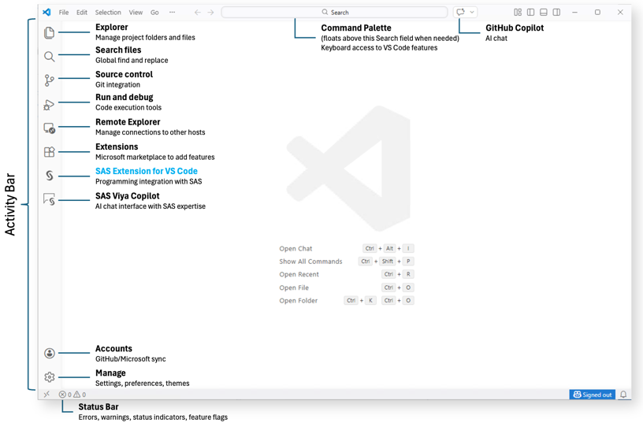

The **Working Area** is in the the center. This is where you work to edit edit code, view logs, and display results. Not much to see there right now. :)

The **Activity Bar** on the left provides access to major VS Code feature areas. Currently it contains several items we will use. These include:

*   The **Explorer** item where folders and files are shown

*   **Source Control** to handle the tasks associated with Git activity, including commits, branching, staging, pushing, pulling, stashing, etc.

*   **Extensions** where you can access and configure additional functionality for VS Code.

*   **SAS** is what we're here for. It's a great example of an extension that extends VS Code's capabilities - in this case, to integrate with your backend SAS environment

And finally, the **Command Palette** at the top is frequently used. Besides providing keyboard-based access to features, it's often the UI element that appears when called and to answer prompts when performing certain tasks.

## Customizing VS Code

Let's customize VS Code and choose a darker color scheme.

Open the VS Code Menu and select **File** > **Preferences** > **Theme** > **Color Theme**:

The **Command Palette** Start prompts you to "Select Color Theme". Type "sas" and choose the **SAS Dark** theme:

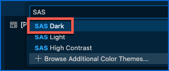

The color scheme is just one of the many preferences you can modify... so now you know where to find them.

## Working with Git

Working with Git repositories in VS Code is extremely easy.

VS Code has integrated source control management (SCM) and includes Git support out-of-the-box.

Let's clone a GitHub repository.

The easiest way to do this is to select the **Source Control** icon in the **Activity Bar** and click the button to **Clone Repository**:


But to showcase the power of the Command Palette, let's take a different approach. In the VS Code menubar, select **View** > **Command Palette...** (alternatively, if you prefer a keyboard shortcut, just type **Ctrl+Shift+P**):


Start typing "Git C" and select **Git: Clone**:

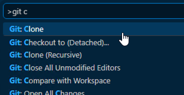

Paste the following URL for this workshop's GitHub repository and press Enter to **Clone from URL**:

```https://github.com/SASInnovate2026/Working-with-the-SAS-Extension-for-Visual-Studio-Code.git```

> &#x26A0; Attention: Do not select **Clone from GitHub** as that uses a different technique requiring a user's authentication credentials.
>
> 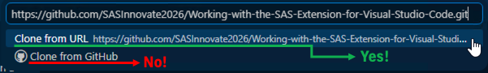

You are then prompted to **Choose a folder to clone into** with a file explorer window.

Any place you prefer is suitable, but for this workshop we'll keep the current "student" home directory. Just click the **Select as Repository Location** button.


When prompted about opening the cloned repository, click **Open**. And when asked if you Trust the Authors, click **Yes**.


You should now see your cloned repository folder in **Explorer**:

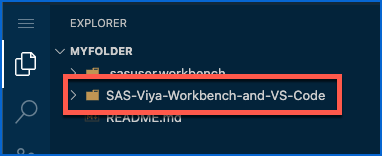

## Working with data

​As a data scientist at an online personal styling service, you’ll use machine learning models to help us analyze customer churn. Customer “churn” simply means that our client has canceled their premium clothing subscription. And since it often is more difficult to find a new customer than keep an existing one, you will help us identify which clients are likely on the cusp of churning, so that we can find ways to retain them.​

In the cloned repository, explore the **Data** folder. It contains various data sets for our project in various formats:

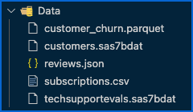

- Customer churn provides metrics about customer activity over the last few months,
- Customers describes customers’ attributes, such as their estimated income, homeowner status and birth date,
- Reviews lists customer reviews on recent purchases,
- Subscriptions provides meaningful details about the customer’s subscriptions,
- And technical support evaluations gives the customers’ feedback on recent interactions with Technical Support.

In this hands-on, we will focus on the data preparation part of the project.

We have two SAS data sets, one CSV file, one JSON file and one Parquet data set.

Let's see how we can integrate those data files.

*Note: Storing data in a Git repository is generally not recommended. While Git excels at version control and collaboration on text-based files like source code, it is not optimized for handling large datasets or binary files. In this hands-on example, we stored sample data in Git for simplicity.*

### Reading SAS data sets

To read SAS data sets, we just need a SAS library.

Create a new SAS file by selecting the VS Code Menu > **File** > **New File...**:

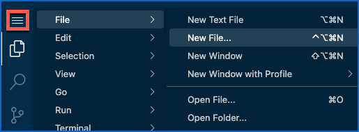

Select **SAS File**:

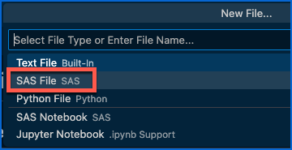

In the new SAS file, copy the following code:

```sas
libname churn "" ;
```

In the Explorer, select the **Data** folder, right-click and select **Copy Path**:

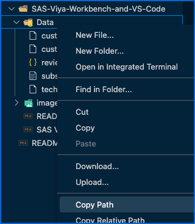

Paste the copied path between the double-quotes in your code.

This should look like the following:

```sas
libname churn "/workspaces/myfolder/SAS-Viya-Workbench-and-VS-Code/Data" ;
```

You're ready to submit this code using the Run button:

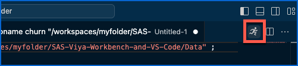

A new pane should have popped up showing the SAS log for this code submission. You're like in the good old SAS Display Manager!

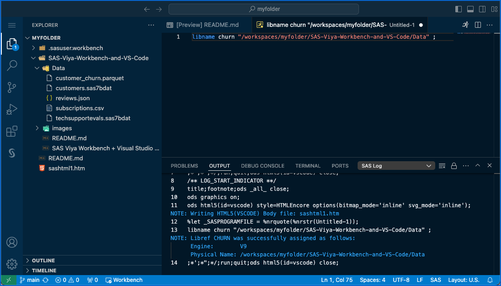

Now, go to the SAS activity (extension) to view your SAS libraries.

You should see the CHURN library and can open the CUSTOMERS table:

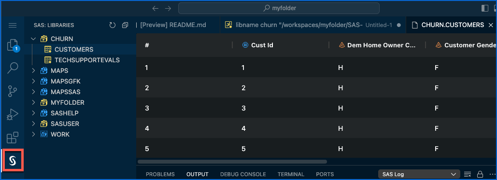

### Reading Parquet data

We will access the Parquet data set using a SAS library. The Parquet file is at the exact same location as the SAS data sets. We will just use a different library engine.

*Note: Parquet is a **columnar storage file format** optimized for efficient data storage and retrieval. It is commonly used in big data processing frameworks like Apache Spark and Hadoop due to its ability to handle large datasets with high performance and reduced storage requirements.*

Back in your SAS file, duplicate the libname statement.

Change the library name to ```churn_pq``` for churn parquet.

Add the ```parquet``` engine between the library name and the path. 

You should have something similar to this:

```sas
libname churn_pq parquet "/workspaces/myfolder/SAS-Viya-Workbench-and-VS-Code/Data" ;
```

Run this line of code.

Check the log:

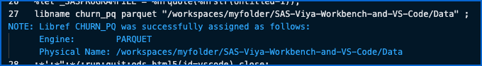

And go to the SAS libraries to see if you can view the Parquet data set:

Indeed, you normally can:

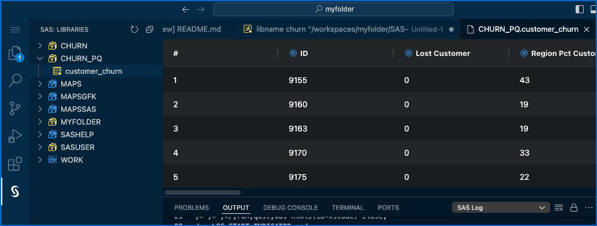

### Reading a CSV file

To read a CSV file, we will need to import it into a SAS data set.

In your SAS file, add the following code:

```sas
proc import file="" out=subscriptions dbms=csv replace ;
run ;
```

Copy the path to the ```subscriptions.csv``` file (right-click on the file > **Copy Path**) and insert it between the double-quotes.

This should look like the following:

```sas
proc import file="/workspaces/myfolder/SAS-Viya-Workbench-and-VS-Code/Data/subscriptions.csv" out=subscriptions dbms=csv replace ;
run ;
```

Run this SAS procedure, check the log and view the resulting data in the WORK library:

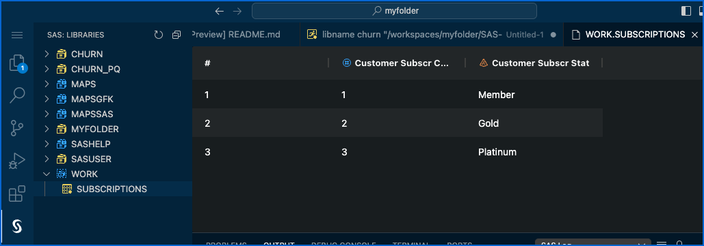

### Reading a JSON file

To read a JSON file, we will also use a special library engine.

In your SAS file, add the following code:

```sas
libname rev json "" ;
proc datasets lib=rev ;
quit ;
```

Copy the path to the ```reviews.json``` file (right-click on the file > **Copy Path**) and insert it between the double-quotes.

This should look like the following:

```sas
libname rev json "/workspaces/myfolder/SAS-Viya-Workbench-and-VS-Code/Data/reviews.json" ;
proc datasets lib=rev ;
quit ;
```

Run the code.

The DATASETS procedure generates some output and should list the logical tables stored in the JSON file.

So, you should see now a **Results** pane popping up:

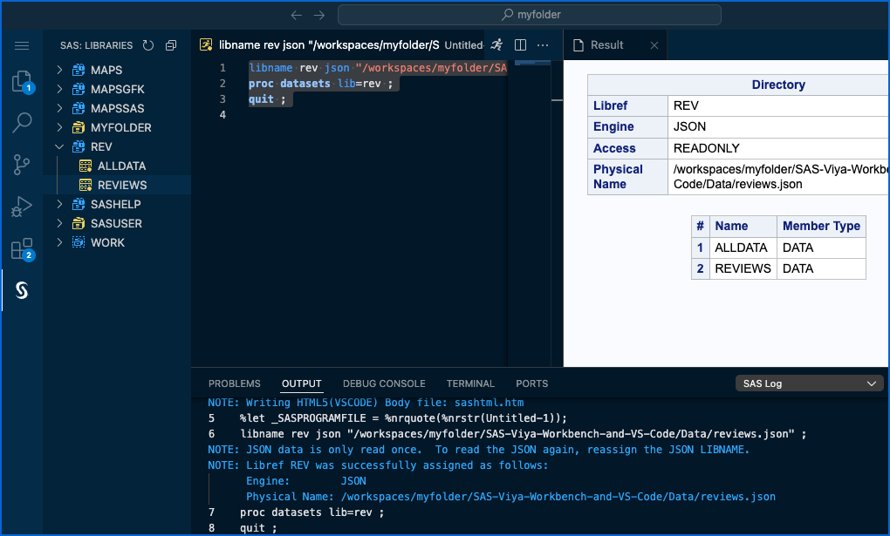

Here we go. We have our three SAS pillars in VS Code: editor, log and output.

Check the log.

Open the resulting REVIEWS table in the REV library.

## Accessing other data

Of course, you're not limited to accessing data solely within a workbench.

With SAS, Python, and soon R, you can access various file formats from multiple locations, including databases, cloud object storage, URLs, web services, REST APIs, and more.

Additionally, you can upload data to your workbench directly from your laptop:

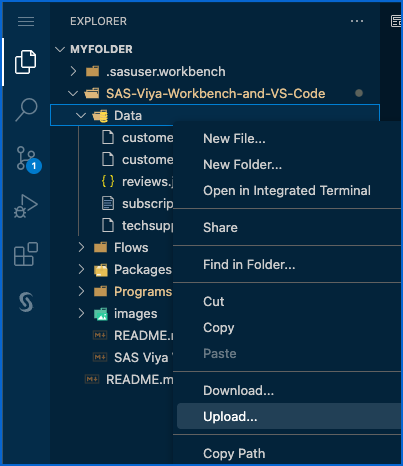

## Interacting with Git and GitHub

Save the SAS program by selecting VS Code Menu > **File** > **Save** and save it in your cloned repository under Programs.

Navigate to ```/workspaces/myfolder/SAS-Viya-Workbench-and-VS-Code/Programs``` and name it ```data_access.sas```:

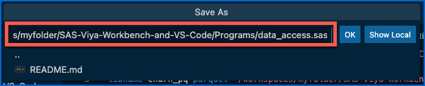

Click **OK**.

You should notice that VS Code has detected a change in your cloned repository. Indeed, your **Source Control** activity should have a badge with at least one pending change:

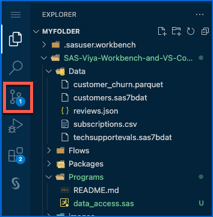

Open the **Source Control** activity and observe that the new SAS program that you created is listed as a pending change in the local cloned repository:

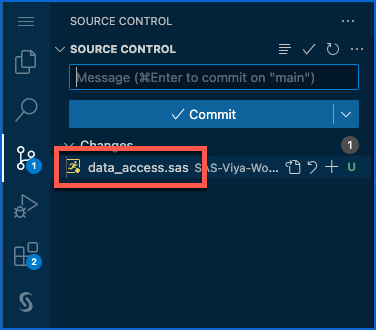

You can go ahead and commit the change in the local cloned repository.

Click the **Stage All Changes** button:

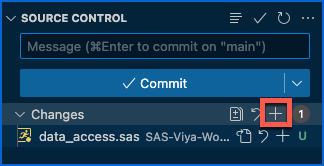

*Note: Clicking either of the + buttons will have the same effect, as there is only one change.*

Add a commit message and click **Commit**:

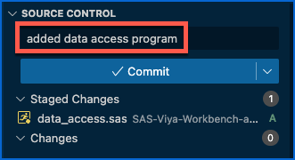

All right. There's a few additional configuration steps needed to be able to commit to a git repository. Click **Cancel**:

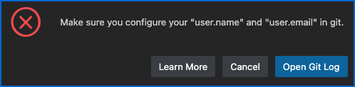

We'll stop here but you get the idea.

Once you commit a change locally, you'd have to push the changes to the remote repository, GitHub here, which would require to be authenticated against GitHub.

## Working with SAS notebooks

One of the nicest features of SAS integration in VS Studio Code is the ability to create notebooks.

A SAS notebook is similar to a Jupyter notebook. It allows you to combine text and SAS instructions and therefore document your actions in a nice-looking way.

Create a new file by selecting the VS Code Menu > **File** > **New File...**.

Select **SAS Notebook**:

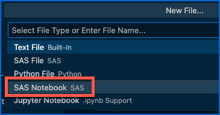

In a SAS notebook, we can mix:

- Markdown, a lightweight markup language used to format text with plain syntax for easy conversion to HTML or other formats,
- SAS code,
- SQL code,
- and soon Python.

In your opened SAS notebook, change the first cell language to Markdown:

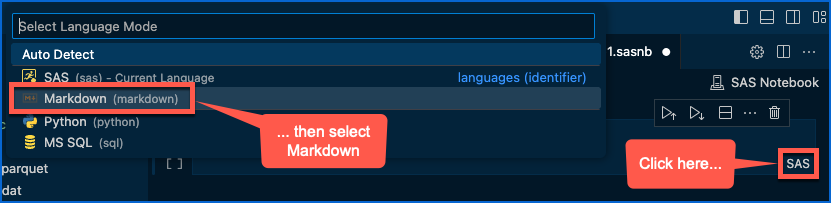

In the Markdown cell, paste the following code:

```markdown
# Discover data

## Customers
```

Validate the code by clicking on the check box:

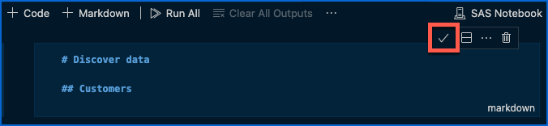

You should see this:

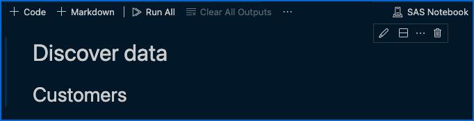

Add a code cell by clicking on **+ Code**:

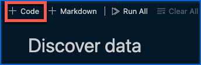

Check that it is a SAS cell:

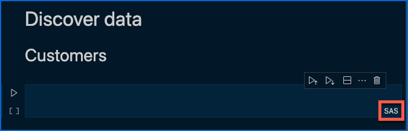

Paste the following code in the cell to list the columns of the SAS data set:

```sas
/* List columns */
proc contents data=churn.customers varnum ;
run ;
```

Run the cell:

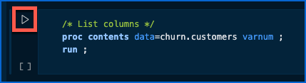

You should get your SAS output right below your code:

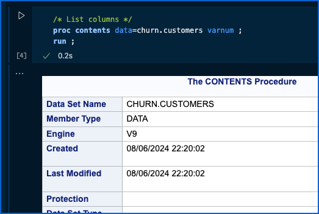

Add a new Markdown cell at the bottom of your output:

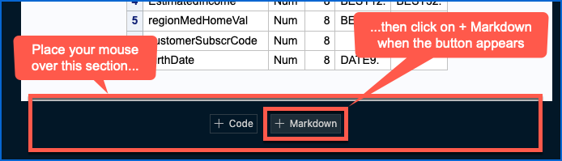

Paste the following code:

```markdown
## Churn
```

Validate the Markdown cell and add a new code cell:

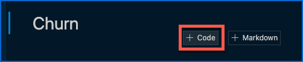

Paste the following code to list the columns of the Parquet data set:

```sas
/* List columns */
proc contents data=churn_pq.customer_churn varnum ;
run ;
```

Run the cell.

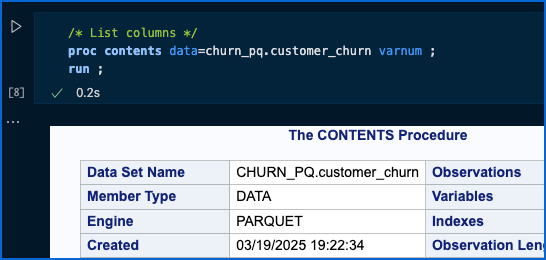

Add a new Markdown cell with the following level-2 title (two # signs): "**Build some distribution reports**".

Validate/submit markdown.

Add a SAS code cell, paste and run the frequency report and plot code:

```sas
proc freq data=churn_pq.customer_churn ;
   tables lostcustomer / plots=freqplot() ;
run ;
```

Check the results and the plot:

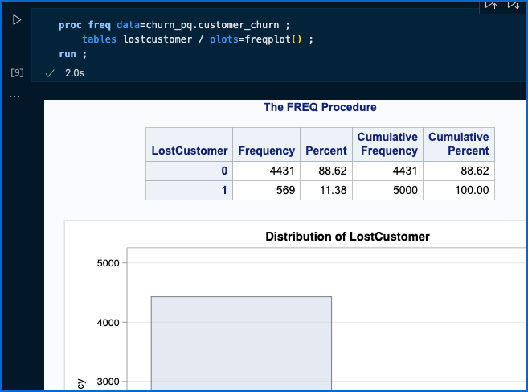

You can observe that a SAS notebook shows SAS output when the SAS code generates it. You'll learn that it displays the SAS log otherwise.

What if you want to check the log when the code generates output?

Click on the ```...``` > **Change Presentation** between the code and the output:

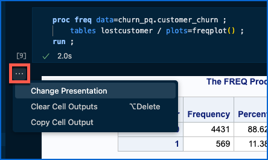

Then select **SAS Log Renderer**:

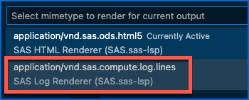

You should see the SAS log now.

Add a new Markdown cell with the following level-1 title (one # sign): "**Join data**".

Add a SQL code cell (the label is mistakenly marked as '**MS SQL**' when it should actually be '**SAS SQL**').

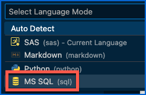

This SQL cell allows you to code directly a SAS SQL statement without having to specify ```proc sql``` and ```quit```.

Use the following code to join all five tables:

```sql
create table churn_wip (drop=custId customerSubscrCode reviewId ordinal_root ordinal_reviews) as
   select *
   from churn_pq.customer_churn as churn
      left join churn.customers as cust on churn.custId=cust.custId
      left join subscriptions as subs on cust.customerSubscrCode=subs.customerSubscrCode
      left join churn.techSupportEvals as evals on churn.ID=evals.ID
      left join rev.reviews as rev on churn.reviewId=rev.reviewId
```

Run the code and check the log.

Check the table in the WORK library in the SAS extension.

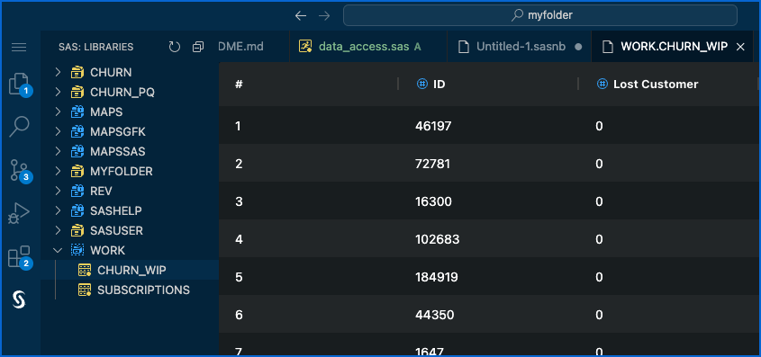

Finally, let's save the final table as a Parquet data set.

Add a new Markdown cell with the following level-1 title (one # sign): "**Save final table in Parquet format**".

Add a SAS code cell and paste the following code to save the table as a Parquet file while adding a computed variable:

```sas
data churn_pq.churn_abt ;
   set churn_wip ;
   customerAge=intck('YEAR',birthDate,today(),'C') ;
run ;
```

Run the code and check the result:

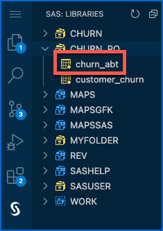

Now, we will check at the file system level how this worked.

Open a new terminal by selecting the VS Code Menu > **Terminal** > **New Terminal**.

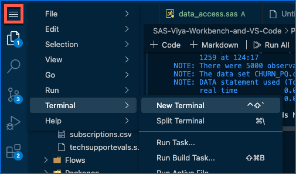

In the terminal, type the following commands:

```shell
cd SAS-Viya-Workbench-and-VS-Code/Data/
ls -ltr
```

You should see the new Parquet file created on disk:

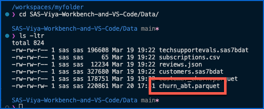

Save the SAS notebook by selecting VS Code Menu > **File** > **Save** and save it in your cloned repository under Programs.

## Working with Python

Your workbench computing environment is not dedicated to simply running SAS code.

It also lets developers, data scientists and modelers code in Python (with R support coming soon) through Visual Studio Code or other Jupyter UIs.

In Explorer, navigate to ```SAS-Viya-Workbench-and-VS-Code/Programs``` and open ```python_sample_data_access.ipynb```:

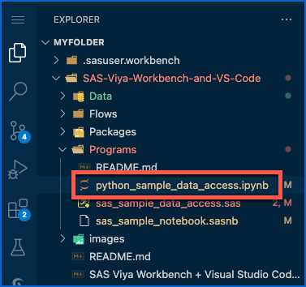

It's a simple Python notebook that demonstrates how to access the same data files as you would with SAS.

Run the notebook by selecting **Run All**:

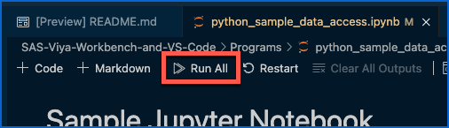

A **Select Kernel** dialog should pop up. Select **Python Environments...**:

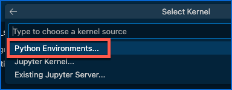

Select the recommended one:

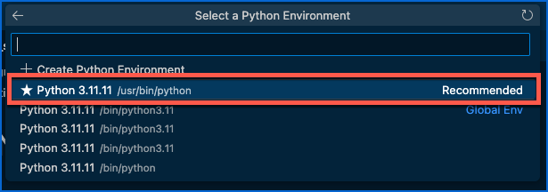

You should see some sample data:

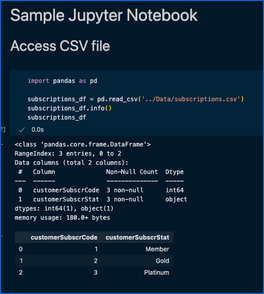

## Closing Visual Studio Code

Simply close your VS Code browser tab.

## Adjusting computing resources

If you need to experiment with different requirements and require more computing resources, you can adjust your workbench's settings.

On the SAS Viya Workbench welcome page, open the settings of your existing workbench:

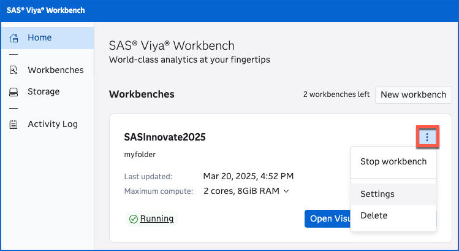

You will see the **Workbench settings** page, where you can change the allocated computing resources according to your site's administration policies.

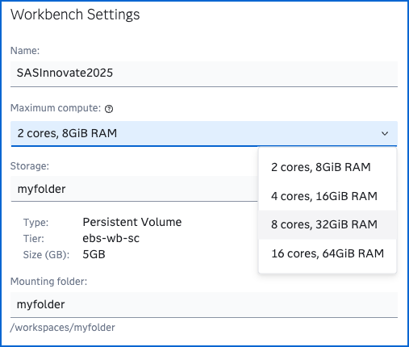

*Note: You might different values since we have limited the configurations available.*

We won't do that today.

This concludes our Hands-On Workshop!

Thanks for participating!

## Going further

### Modern Data Science with SAS Viya Workbench and Python

Curious about how an end-to-end data science project is managed in SAS Viya Workbench?

You can check this [free course](https://communities.sas.com/t5/SAS-Viya-Workbench-Getting/Modern-Data-Science-with-SAS-Viya-Workbench-and-Python/ta-p/947920) and its [materials](https://github.com/sassoftware/sas-education/tree/main/sas1).

### SAS Extension for Visual Studio Code

Good news! The SAS Extension for Visual Studio Code is not limited to SAS Viya Workbench. You can install it in your own VS Code instance and use it to connect to your SAS Viya or SAS 9 environment.

Check [here](https://developer.sas.com/programming/vs_code_extension) for more information.
